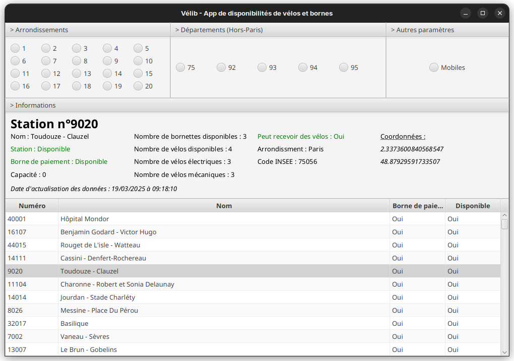

# Projet Vélib

> [!NOTE]
> Il s'agit d'un projet de formation. / This is a projet 

    

 

Vélib est une application de disponibilités de vélos et de bornes. Ces derniers sont disponibles dans les arrondissements de Paris ainsi que dans d'autres départements d'Île de France (92, 93, 94 et 95).

Cette application est entièrement codé sous le langage Java avec des bibliothèques tels que :
- JavaFX (pour créer une application graphique)
- JSON (pour parser facilement les données sous format JSON)

De plus, l'API d'Open Data de Paris est utilisée pour cette application. Le fichier JSON est stocké dans ce projet pour rendre ces données intègre.

## Aperçu

_Représentation de l'application Vélib_